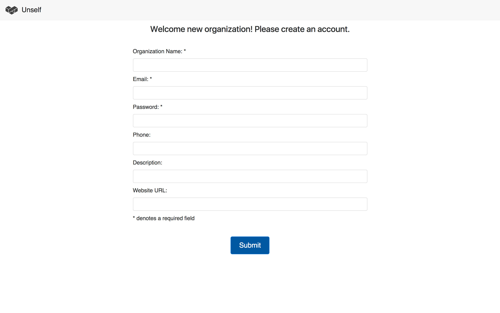

[Retrospective](retro.md "Retrospective")

# Q2-Unself-Volunteer-App

Volunteering made easy!

## Welcome To The Home Page!

**Register Here:** On our homepage you can register as either a volunteer or an organization.

*Volunteers* can browse events that interest them and sign up.

*Organizations* can create events for volunteers to sign up for.

## Login To Begin

**Log In Here:** If you already have an account you can log in using our login page.

## Create An Organization

**Register Your Organization:** Create an account for your organization so you can start creating events!

## Create An Event

**Create Your New Event:** This event will be displayed to potential volunteers.

## Browse Events

**Check Out Upcoming Events!**

## Event Page

**View Event Details:** Visit an events page to see all the specifics and roles still needing volunteers. Just one click signs you up. If you decide you can't go just click again to remove yourself from the event.

  ## View Your Events

**Your Event Page:** As a volunteer you can see all the events you have signed up for in one convenient place.

## About

#### Purpose

This is our quarterly project we did at Galvanize while working with the social technology company [Unself](https://www.unself.com/welcome "Unself") to build out a new feature for their volunteer app. Their app provides a way for volunteers to keep track their volunteer hours in a simple, straightforward way. Our application extends this functionality by allowing organizations to post upcoming events and volunteers to sign up for specific roles at these events. This empowers both parties by decreasing the gap between organizations and volunteers.

This app was both quite challenging and a lot of fun to work on. The technologies we used in this app are HTML, CSS, JavaScript, and Jquery on the front end, and Node, Express, and Postgres for the backend. We wanted to give a very big thank you to Unself for allowing us the chance to work with you and taking the time to give us advice and guidance. We see great potential for your mission and wish you the best on it. Thanks everyone for coming out!

#### The Team

- Tucker Triggs

  [GitHub](https://github.com/tuckpuck "GitHub Page") [LinkedIn](https://www.linkedin.com/in/tuckertriggs/ "LinkedIn Page")

- Shelby Valdes

  [GitHub](https://github.com/rsvaldes "GitHub Page") [LinkedIn](https://www.linkedin.com/in/shelby-valdes-287a9313b/ "LinkedIn Page")

- Linda Call

  [GitHub](https://github.com/lindacall4home "GitHub Page") [LinkedIn](https://www.linkedin.com/in/linda-call/ "LinkedIn Page")

- David Leonhardt

  [GitHub](https://github.com/dwleonhardt "GitHub Page") [LinkedIn](https://www.linkedin.com/in/dwleonhardt/ "LinkedIn Page")
